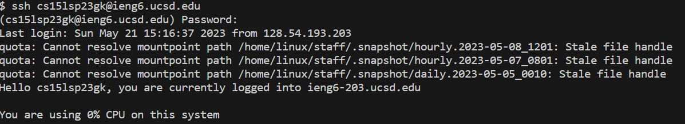
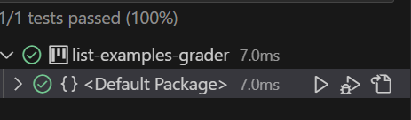

# Creating SSH Keys

## Getting started
- We begin by logging into our ieng6.ucsd account 
> Once we login to ieng6, we can then login to our Github account and clone the lab7 repository 

- We have to also create an ssh key by using the `ssh-keygen` command in the terminal 
- This will create a unique ssh key that we will configure to be used for our Github account
- We first must concatenate the ssh key path and then copy and then paste this into the "Add SSH Key" option in our Github account

## Testing 
- Once the lab7 repo has been cloned, we can now finally test our code
- First, make sure we are in the correct directory by doing `cd lab7` otherwise the tests will not work 
- The we type in `javac -cp .:lib/hamcrest-core-1.3.jar:lib/junit-4.13.2.jar ListExamples.java`
- Followed by: `java -cp .:lib/hamcrest-core-1.3.jar:lib/junit-4.13.2.jar org.junit.runner.JUnitCore` 

> We can fix the tests by replacing `index1` with `index2` in the ListExamples.java file

- Once we see that the tests have passed we can finish by commiting to github
- We do this we can commit and push to Github 
- When commiting the changes to GitHub, we are given the option to add a message
- We wrote "Updated" to show what was changed

